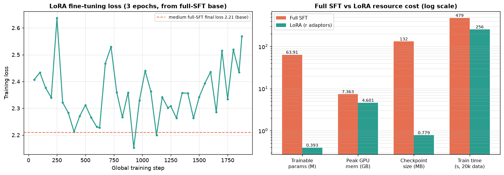
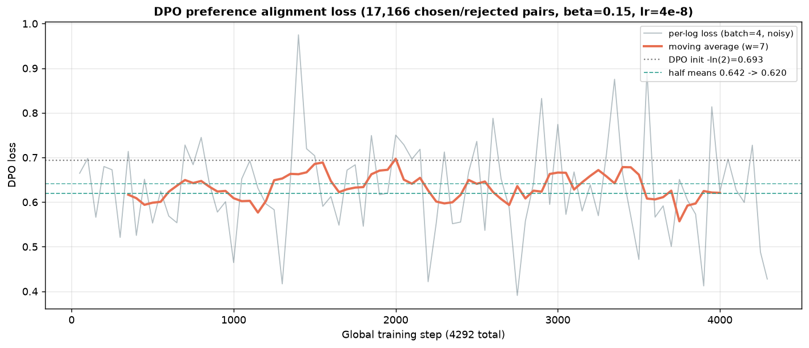
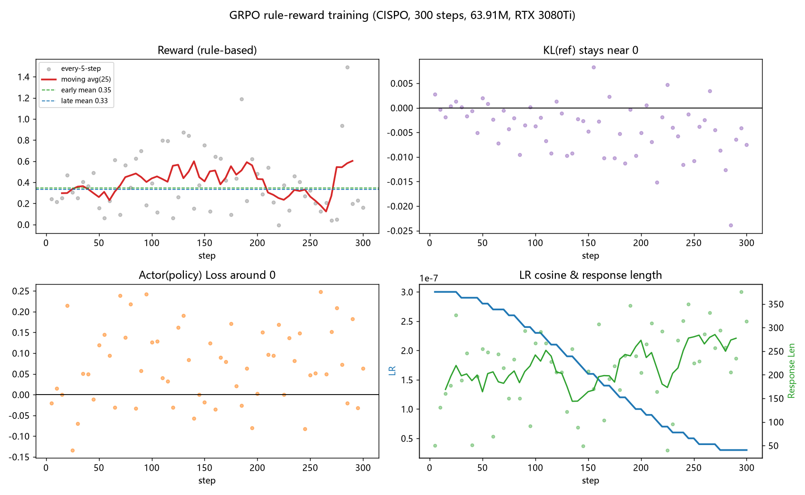

# MiniMind From Scratch（从零构建轻量级语言模型）

> 📚 **本模块属于 [Hands-on-LLM 动手学大模型](../README.md) 学习库 · 返回总览看完整学习路线**

> 不依赖高层封装，用原生 PyTorch 逐层实现现代轻量级语言模型的核心组件，并完整跑通
> **预训练 → SFT → LoRA → DPO → GRPO** 的训练链路。
>
> 本仓库复现自 [jingyaogong/minimind](https://github.com/jingyaogong/minimind)（MIT License），
> 并在其基础上补充三部分自己的工作：**① 不看参考实现的手写组件；② 分阶段/多方法对比实验；③ 源码与公式推导笔记。**

> **✅ 最新进展（2026-09）**：已在单卡 RTX 3080 Ti 上完整跑通「继续预训练 → SFT → LoRA → DPO → GRPO」**五阶段**，
> 做了 **small / medium 两档数据规模对照**、**全量微调 vs LoRA 资源对比**、**DPO 偏好对齐**与 **GRPO 纯规则强化学习（300 步真实训练 + 同种子前后对比）**，产出真实 loss/reward 曲线、显存/耗时/吞吐与生成样例。
> 详见 [`experiments/`](experiments/)（[实验详解](experiments/README.md) · [生成样例](experiments/generation_samples.md) · [复现步骤](reproduced/)）。

## 一、项目目标
- 手写 BPE 分词器与 Transformer Decoder：RMSNorm、RoPE、GQA、SwiGLU、Causal Attention；
- 跑通 “数据清洗去重 → 预训练 → SFT → LoRA → DPO → GRPO” 全流程，记录每阶段 loss / 显存峰值 / 吞吐 / 耗时 / 生成效果；
- 用 Triton 编写 RMSNorm 前向/反向融合 Kernel（已实现，GPU 数值对齐，见 from_scratch/kernel_rmsnorm.py）；手写分块 Flash Attention 仍为后续规划；
- 本模块单卡训练实践混合精度（BF16）、梯度检查点等显存优化；DeepSpeed ZeRO 多卡并行在 ③ 工业框架模块实测（见 ../03-peft-framework/experiments/dist_lab）；
- 依据 Chinchilla 结论拟合 Scaling Law，核算训练资源。

## 二、目录结构
| 目录 | 内容 |
| --- | --- |
| `from_scratch/` | **手写组件**：不看官方实现，自己写的 tokenizer 与模型模块（核心） |
| `reproduced/` | 基于官方仓库跑通的训练脚本、确切命令与踩坑记录（注明来源，非原创） |
| `experiments/` | 对比实验记录：训练日志 CSV、loss 曲线、显存/耗时、生成样例 |
| `notes/` | 源码阅读笔记、RoPE/DPO/GRPO 等公式推导 |

## 三、运行环境
- OS: Ubuntu 22.04（云 GPU）/ Windows 11；Python 3.10；CUDA 12.4；PyTorch 2.6.0
- **实测单卡 RTX 3080 Ti 12GB 即可训练 63.9M 参数模型**：bf16 下全量微调显存峰值约 7.4GB、LoRA 仅 4.6GB，GPU 利用率 96–99%

```bash
conda create -n minimind python=3.10 -y && conda activate minimind
# 注意：若 pip 拉取 torch/nvidia 大包零增长卡死，改用 curl 下载 wheel + 离线安装，见 reproduced/README.md
pip install torch==2.6.0 --index-url https://download.pytorch.org/whl/cu124
pip install transformers==4.57.6 datasets==3.6.0 modelscope sentencepiece trl peft accelerate einops safetensors
python -c "import torch; print(torch.cuda.is_available(), torch.cuda.is_bf16_supported())"
```

## 四、复现路线 Checklist
- [x] 环境搭建、数据下载（ModelScope）与等间隔抽样构造子集
- [x] 预训练（Pretrain，from scratch，bf16 + 梯度累积 + cosine 调度）
- [x] 指令微调（SFT，从 pretrain 热启动，多轮对话仅对 response 计算 loss）
- [x] LoRA 参数高效微调（只训 0.61% 参数，对比全量微调的显存/体积/耗时）
- [x] BPE 分词器自行训练（手写字节级 BPE，见 `from_scratch/tokenizer_bpe.py`，20 项自检）
- [x] DPO 偏好对齐（17k 偏好对、β=0.15，验证 -ln2 初始与隐式 reward margin 拉开）
- [x] GRPO 强化学习对齐（纯规则奖励免 1.8B 奖励模型，300 步 / 21.7 min；规则分 0.109→0.290、|KL|≈0.005）
- [x] GRPO 100 条 held-out 定量评测（排除训练题，规则分 +0.084、3-gram 重复度 0.120→0.096）
- [x] 五阶段同种子生成横评（pretrain→GRPO 能力演进，见 experiments/stage_evolution.md）
- [x] 架构/精度消融：MHA/GQA/MQA × fp32/bf16/fp16 × batch 显存吞吐 + 推理 KV cache（见 experiments/ablation/）
- [x] Triton RMSNorm 融合 Kernel 已完成（前向+反向，见 from_scratch/）；分块注意力（Flash Attention）仍待做
- [x] DeepSpeed ZeRO 多卡对照（DDP/ZeRO-1/2/3）在 ③ 工业框架模块实测，见 ../03-peft-framework/experiments/dist_lab（本模块为单卡手写模型）

## 五、手写组件 Checklist（`from_scratch/`）
- [x] BPE Tokenizer（merge 规则、编解码，字节级底座保证无 OOV）
- [x] RMSNorm（对比 LayerNorm，含数值自检）
- [x] RoPE 旋转位置编码（rotate-half，验证相对位置不变性/保模长）
- [x] GQA（repeat_kv 统一 MHA/MQA/GQA + 因果遮蔽，12 项自检）
- [x] SwiGLU 前馈网络（门控分支数值验证）
- [x] Causal Self-Attention（含 mask、张量维度标注、未来不可见测试）
- [x] Triton 版 RMSNorm Kernel（融合前向+反向，10 项 GPU 数值自检通过）
- [ ] 分块 Online-Softmax（Flash Attention 核心）

## 六、实验结果（已完成：Pretrain + SFT + LoRA + DPO + GRPO + 可验证奖励 RLVR）


模型固定为 **63.91M**（hidden 768 / 8 层 / GQA，KV 头=4 / 词表 6400，bf16），两档数据规模对照：

| 实验 | 阶段 | 数据量 | 步数 | 耗时 | loss（起→终） | 显存峰值 | GPU 利用率 |
| --- | --- | --- | --- | --- | --- | --- | --- |
| small | Pretrain | 60,000 | 3,750 | 10.3 min | 7.73 → **3.35** | 7.36 GB | 97.1% |
| small | SFT | 20,000 | 2,500 | 8.0 min | 3.91 → **3.17** | 7.36 GB | 97.1% |
| **medium** | Pretrain | 150,000 | 9,376 | 25.5 min | 7.31 → **2.53** | 7.36 GB | 98.8% |
| **medium** | SFT | 50,000 | 6,250 | 19.6 min | 2.82 → **2.21** | 7.36 GB | 98.8% |
| LoRA | 在 medium-SFT 上 | 20,000 | 1,875 | 4.3 min | 围绕 2.21 波动 | **4.60 GB** | 96.0% |
| DPO | 在 medium-SFT 上 | 17,166 对 | 4,292 | 12.4 min | 0.693→0.62（均值） | 5.71 GB | 98.4% |
| GRPO | full_sft 热启动 | 600 prompt | 300 | 21.7 min | 规则分 0.109→0.290；100 条 held-out +0.084 | 9.9 GB | rollout 为主 |
| **RLVR** | arith_sft 冷启动(一位加法) | 4,000 题 | 300 | — | held-out greedy 0.633→**0.792**、采样 0.503→0.603 | — | rollout 为主 |





**GRPO（纯规则奖励 / CISPO，免学习型奖励模型）**：



- **数据规模效应**：pretrain 数据 ×2.5，最终 loss 3.35→2.53，生成连贯度与指令遵循明显改善。
- **消融**：只预训练的模型只会续写、无法遵循指令；经 SFT 后才学会 chat template 与助手式作答。
- **PEFT 性价比**：LoRA 只训 **0.393M（0.61%）** 参数、适配器仅 **0.78MB**（全量 132MB）、显存降 37%，可热插拔叠加。
- **DPO 偏好对齐**：loss 从理论值 -ln2=0.693 缓慢下移（区间均值 0.642→0.620），让输出更收敛；DPO 调偏好不增知识。
- **GRPO 强化学习**：免 1.8B 奖励模型、改纯规则奖励，300 步耗时 21.7 min；组内优势均值**严格为 0**（组内中心化）、平均 |KL|≈0.005（β=0.1 锚定、策略未漂移）、LR 3e-7→3e-8 余弦衰减；同 prompt/同种子前后对比，**规则分 0.109→0.290**（输出长度更受控、思维链格式更规范、重复更少）。规则只约束格式不判对错，**内容正确性不因此提升**，原始日志/曲线/对比见 [`experiments/grpo/`](experiments/grpo/)。
- **GRPO 扩样评测与五阶段横评**：在 100 条**未参与训练**的 held-out 题上规则分 0.255→0.339（+0.084）、3-gram 重复度 0.120→0.096，与 5 条对比方向一致且更稳健；并用同种子让五个阶段同题生成，直观看出 **pretrain→SFT 能力跃迁最大**、后三阶段为精细调整，见 [experiments/stage_evolution.md](experiments/stage_evolution.md) 与 [experiments/grpo/](experiments/grpo/)。
- **架构与精度消融**：同骨架只改 KV 头数，MHA/GQA/MQA 参数 68.6/63.9/60.4M；训练侧（bs8,bf16）峰值显存 2623/2490/2312MB、吞吐 60/64/70 k tok/s（MQA 比 MHA 快约 16%）；**推理 KV cache@4096 = 100.7/50.3/12.6MB，与 KV 头数成正比（MQA 仅 MHA 的 1/8），这才是 GQA/MQA 主价值**；bf16 比 fp32 省 35–49% 显存、约 1.8× 吞吐。见 [experiments/ablation/](experiments/ablation/)。
- **可验证奖励 RLVR（答案对错自动判分）**：一位加法先 SFT 冷启动到甜区（greedy 0.633、采样 0.503），再用可验证奖励 GRPO（答对+1/错 0，B8×G4、lr 4e-6、β-KL 0.08、300 步）把**独立 120 题 greedy 提到 0.792（+25%）、三种子采样均值 0.503→0.603（+20%）**；对照实验证明 RL 只放大已有能力、不注入知识（任务超能力边界则组内全错无梯度、SFT 到顶则无空间、lr 过大且 KL 过弱会策略崩溃），见 [experiments/verifiable_rl/](experiments/verifiable_rl/)。
- 推理（FP16）解码速度约 47–100 tokens/s；GPU 画像见 `experiments/assets/gpu_profile.png`。
- **诚实的局限**：仅用约 5% 全量语料 + 63M 参数，仍有事实错误/重复/代码错误，符合 Chinchilla 对小模型 token 量的判断。
- 逐步 loss 数据：[`experiments/training_log.csv`](experiments/training_log.csv) 与各档 `*_curve.csv`；完整分析见 [`experiments/README.md`](experiments/README.md)。

## 七、学习笔记
- [架构组件推导](notes/architecture.md)（[Word](notes/architecture.docx)）：RMSNorm / RoPE / GQA / SwiGLU / 残差与 Pre-Norm 的公式推导
- [对齐算法推导](notes/alignment.md)（[Word](notes/alignment.docx)）：SFT 损失、DPO 闭式解、GRPO 组内优势、与 PPO 的区别
- **[训练全流程小白详解](notes/training-pipeline-explained-zh.md)（[Word 版](notes/training-pipeline-explained-zh.docx)）**：用大白话+类比讲透 Pretrain→SFT→LoRA→DPO→GRPO→RLVR 每一步是什么、为什么、看哪些日志数字，配本项目单卡真实结果

## 八、参考与致谢
- 原始项目：[jingyaogong/minimind](https://github.com/jingyaogong/minimind)（MIT）
- 数据集：ModelScope `gongjy/minimind_dataset`
- 论文：RoFormer(RoPE)、GQA、GLU Variants(SwiGLU)、LoRA、DPO、DeepSeekMath(GRPO)、FlashAttention、Chinchilla

> 说明：`reproduced/` 内为对原项目的学习性复现，著作权归原作者；`from_scratch/`、`experiments/`、`notes/` 为独立实现与记录。
