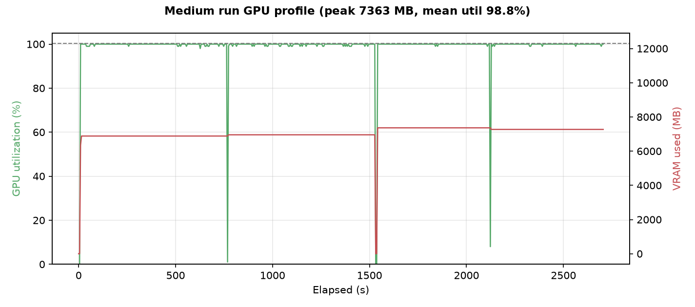

# 实验记录（Experiments）

> 单卡 **RTX 3080 Ti 12GB** 上，从零复现 MiniMind（63.9M）的 **继续预训练 → 监督微调（SFT）→ LoRA 参数高效微调 → DPO 偏好对齐** 全流程。
> 所有数字均来自真实训练日志（`*/` 目录下的 `*_curve.csv`、`metrics.txt`），曲线图见 `assets/`。

## 1. 运行环境

| 项 | 配置 |
| --- | --- |
| GPU | 1 × NVIDIA RTX 3080 Ti（12 GB GDDR6X），驱动 580.76.05 |
| 框架 | Python 3.10、PyTorch 2.6.0+cu124、Transformers 4.57.6、datasets 3.6.0 |
| 精度 | BF16 混合精度（`torch.cuda.amp.autocast`） |
| 模型 | MiniMind，hidden=768、8 层、8 头、**GQA（KV 头=4）**、词表 6400，主干 **参数量 63.91M** |
| 数据 | ModelScope `gongjy/minimind_dataset`：pretrain 全量 127.0 万条、SFT 全量 90.6 万条多轮对话 |

> 复现踩坑：该机器上 `pip` 直接拉取数百 MB 的大 wheel（torch / nvidia-cudnn 等）会零增长卡死，
> 最终改用 **curl 逐包下载 + `pip install --no-index --find-links` 离线安装**解决，详见 `../reproduced/`。

## 2. 数据准备：等间隔抽样

全量数据在单卡上训练 2 轮需要十余小时。为在可控时间内完成端到端复现并对比**数据规模效应**，
采用**等间隔抽样**（每隔 k 行取 1 条，覆盖整个文件、避免头部数据分布偏斜）构造两档子集：

| 子集 | pretrain 条数 | SFT 条数 | 占全量比例（pretrain/SFT） |
| --- | --- | --- | --- |
| small | 60,000 | 20,000 | 4.7% / 2.2% |
| medium | 150,000 | 50,000 | 11.8% / 5.5% |

抽样脚本见 `../reproduced/make_subsets.py`。

## 3. 超参数

| 阶段 | batch | 梯度累积 | 有效 batch | 学习率 | 调度 | 最大长度 | epochs |
| --- | --- | --- | --- | --- | --- | --- | --- |
| Pretrain | 32 | 8 | 256 | 5e-4 | cosine + warmup | 340 | 2 |
| SFT | 16 | 1 | 16 | 1e-5 | cosine | 768 | 2 |
| LoRA | 32 | 1 | 32 | 1e-4 | cosine | 340 | 3 |
| DPO | 4 | 1 | 4 | 4e-8 | — | 1024 | 1 |

优化器 AdamW、梯度裁剪 1.0；SFT 从上一阶段 pretrain 权重热启动，且**仅对 assistant 回复部分计算损失**；
LoRA 在 medium 的 full-SFT 基座上只训练注入的低秩适配器（rank 适配 Q/V 等投影），主干全部冻结。

## 4. Pretrain + SFT 结果

| 实验 | 阶段 | 训练步数 | 耗时 | 起始→最终 loss | 显存峰值 | 平均 GPU 利用率 |
| --- | --- | --- | --- | --- | --- | --- |
| **small** | Pretrain | 3,750 | 10.3 min | 7.73 → **3.35** | 7.36 GB | 97.1% |
| **small** | SFT | 2,500 | 8.0 min | 3.91 → **3.17** | 7.36 GB | 97.1% |
| **medium** | Pretrain | 9,376 | 25.5 min | 7.31 → **2.53** | 7.36 GB | 98.8% |
| **medium** | SFT | 6,250 | 19.6 min | 2.82 → **2.21** | 7.36 GB | 98.8% |

## 5. LoRA 参数高效微调（PEFT）

在 medium full-SFT 基座上，用同一份 2 万条 SFT 子集训练 LoRA 适配器（3 轮、1875 步、**256 秒**）：

| 指标 | 全量 SFT | LoRA | 对比 |
| --- | --- | --- | --- |
| 可训练参数量 | 63.91 M | **0.393 M** | LoRA 仅为全量的 **1/163（0.61%）** |
| 检查点体积 | 132 MB | **0.779 MB** | 缩小约 169 倍，便于多任务分发 |
| 显存峰值 | 7.36 GB | **4.60 GB** | 降低约 37%（冻结主干、优化器状态更少） |
| 20k 数据训练耗时 | 479 s（2 epoch） | **256 s（3 epoch）** | 轮次更多反而更快 |
| loss | 收敛到 2.21 | 在 2.15–2.57 间围绕基座波动 | 见下方分析 |

**分析（诚实）**：LoRA 从已经拟合好的 full-SFT 基座起步，loss 本就处于 2.2 水平，再用**同分布**数据训练不会显著下降，
而是围绕基座小幅波动——这正说明低秩适配**没有破坏基座已有能力**（无灾难性遗忘），其价值在于以极小代价做**增量/领域适配**。
推理时把 0.78MB 适配器叠加到冻结基座即可正常生成（`eval_llm.py --weight full_sft --lora_weight lora_demo`），
且模型对「你是谁」类身份认知回答更稳定。若要体现 LoRA 的领域增益，应换用医疗/身份等**专门领域小数据**（对应官方 `lora_medical`）。

## 6. DPO 偏好对齐（Direct Preference Optimization）

在 medium full-SFT 基座上，用 **17,166 对 chosen/rejected** 偏好数据做 DPO（β=0.15、lr=4e-8、batch=4、1 轮 4292 步、**744 秒**）。
DPO 需同时持有 policy 与冻结的 reference 两个模型，故显存略升到 5.71GB。

| 指标 | 数值 |
| --- | --- |
| 偏好对 / 步数 | 17,166 对 / 4,292 步 |
| 耗时 | 12.4 min |
| 理论初始 loss | -ln2 = **0.693**（chosen、rejected 等概率） |
| 区间均值 | 前半 0.6415 → 后半 **0.6201** |
| 末步 / 最低 loss | 0.4276 / 0.3908 |
| 显存峰值 / 利用率 | 5.71 GB / 98.4% |

**分析**：DPO loss 从理论值 -ln2≈0.693 起步，训练后移动平均缓慢下移，说明 chosen 相对 rejected 的对数概率差（隐式 reward margin）被逐步拉开；
因学习率刻意取极小（4e-8，防止灾难性遗忘）且 batch=4 噪声大，曲线呈「高噪声、缓慢下降」形态。
DPO **只调整输出偏好/风格、不增加知识**：对齐后回答更简短收敛（见 `generation_samples.md`），但 63M 的知识边界不变。

## 7. GPU 画像与推理速度

- 训练阶段 GPU 利用率长期 96–99%、温度峰值 72–75°C；显存峰值 pretrain/SFT 7.36GB、LoRA 4.60GB。
- 推理（FP16，单条 `model.generate`）解码速度约 **47–100 tokens/s**。

## 8. 关键发现

1. **数据规模的边际收益清晰可见**：pretrain 数据量 ×2.5（6 万→15 万），同架构同超参下最终 loss 由 3.35 降到 2.53；
   SFT 由 3.17 降到 2.21，medium 模型生成的语句连贯度、指令遵循度明显更好（见 `generation_samples.md`）。
2. **Pretrain 与 SFT 分工明确（消融）**：只做 pretrain 的模型只会**续写**、无法遵循指令
   （让写斐波那契函数时输出一串数字）；经过 SFT 后才学会 chat template、以助手身份分点作答。
3. **PEFT 性价比**：LoRA 只训 0.61% 参数、检查点缩小两个数量级、显存降 37%，适合多领域低成本适配与热插拔。
4. **小模型单卡可训**：63.9M 模型在 12GB 卡上 bf16 训练毫无压力，瓶颈在**数据量与训练 token 数**而非显存/算力。
6. **DPO 对齐特性**：loss 从理论值 -ln2 起步、以极小学习率缓慢下移，验证了偏好目标；DPO 改变输出风格而非知识容量，需严格控制 lr 防止遗忘。
5. **loss 与生成质量并不完全等价**：SFT loss 降到 2.2 后模型能稳定输出结构化中文，但受 63M 参数 + 仅约 5% 全量语料限制，
   仍有事实错误、重复、代码语法错误——与 Chinchilla「小模型需要足够 token」的结论一致，是后续扩数据/扩参的方向。

## 9. 目录与复现

- `small/`、`medium/`、`lora/`、`dpo/`：各自的 `*_curve.csv`（逐步 loss/lr）、`metrics.txt`、原始生成记录、GPU 采样 CSV；
- `assets/`：loss 对比曲线、GPU 画像、LoRA 资源对比图；
- `generation_samples.md`：pretrain-only / small-SFT / medium-SFT / LoRA / DPO 生成样例对比；
- 完整复现命令见 [`../reproduced/`](../reproduced/)；逐步汇总见 [`training_log.csv`](training_log.csv)。

> 说明：模型权重（主干 .pth 约 132MB、LoRA 适配器 0.78MB）按 `.gitignore` 约定不上传；数据来自 ModelScope 公开数据集，按其许可使用。
