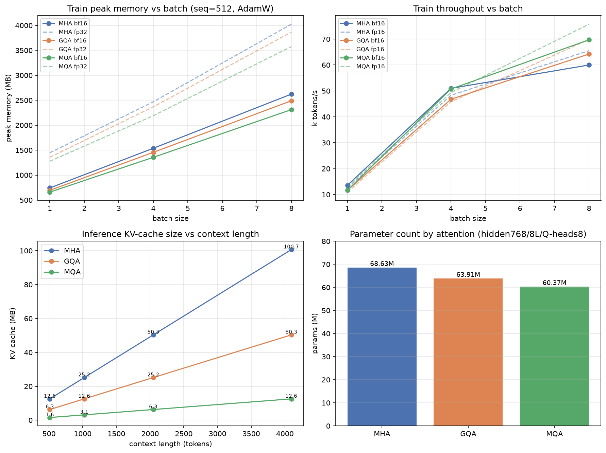

# 架构与精度消融：MHA / GQA / MQA × fp32 / bf16 / fp16 × batch

> 单卡 RTX 3080 Ti 实测，脚本 [`../../reproduced/bench_arch.py`](../../reproduced/bench_arch.py)，原始数据 `arch_ablation.csv`、`kv_cache.csv`，图 `../assets/arch_ablation.png`。

## 0. 实验设置

- 固定 hidden=768、8 层、Q 头=8、head_dim=96、词表 6400、seq_len=512，只改 **KV 头数**：MHA=8（每 Q 头各一组 KV）、GQA=4（本模型，2 个 Q 头共享一组 KV）、MQA=1（所有 Q 头共享一组 KV）。
- 训练口径：随机权重 + 一次完整 forward→cross-entropy→backward→AdamW step，warmup 2 次、计时 5 次取均；记录峰值显存与吞吐。**用随机权重是因为这里测的是架构/精度的算力与显存开销，与权重数值无关。**
- 推理口径：KV cache = `2(K,V) × 层数 × KV头数 × head_dim × 上下文长度 × 每元素字节数`。

## 1. 参数量（只动 K/V 投影，Q/O 不变）

| 架构 | KV 头 | 参数量 | 相对 MHA |
| --- | ---:| ---:| ---:|
| MHA | 8 | 68.631 M | — |
| **GQA（本模型）** | 4 | 63.912 M | **-6.9%** |
| MQA | 1 | 60.373 M | -12.0% |

## 2. 训练显存峰值（MB，seq=512，含参数+梯度+AdamW+激活）

| batch | MHA fp32 | GQA fp32 | MQA fp32 | MHA bf16 | GQA bf16 | MQA bf16 |
| ---:| ---:| ---:| ---:| ---:| ---:| ---:|
| 1 | 1447 | 1357 | 1278 | 743 | 695 | 659 |
| 4 | 2469 | 2369 | 2190 | 1538 | 1457 | 1356 |
| 8 | 4024 | 3866 | 3576 | **2623** | 2490 | **2312** |

- **混合精度收益**：bs=8 时 MHA fp32→bf16 显存 4024→2623 MB（**-35%**），bs=1 时 -49%；bf16 与 fp16 显存完全相同（都是 2 字节）。
- **架构收益（训练侧温和）**：bs=8、bf16 下 MHA→GQA -5%、MHA→MQA -12%。训练激活的大头是 Q 的注意力分数矩阵和 FFN，它们与 KV 头数无关，所以训练时省得有限。

## 3. 训练吞吐（k tokens/s）

| batch | MHA bf16 | GQA bf16 | MQA bf16 | MHA fp16 | GQA fp16 | MQA fp16 |
| ---:| ---:| ---:| ---:| ---:| ---:| ---:|
| 1 | 13.6 | 11.7 | 11.7 | 12.6 | 11.0 | 13.1 |
| 4 | 51.0 | 46.8 | 50.7 | 48.3 | 45.8 | 49.4 |
| 8 | 60.0 | 64.2 | **69.7** | 65.5 | 69.9 | **75.7** |

- bs=8、bf16 下 MQA 比 MHA 快约 **16%**（K/V 投影与注意力计算量更小）；fp16 略快于 bf16。
- bf16 相对 fp32 在 bs=8 约 **1.8×** 吞吐（MHA 33.6→60.0k tok/s）。
- **bs=1 时三者几乎无差异**：小 batch 被 kernel launch 等固定开销主导，算子优势要在合理 batch 下才显现。

## 4. 推理 KV cache（真正的大头，MB）

| 上下文长度 | MHA | GQA | MQA |
| ---:| ---:| ---:| ---:|
| 512 | 12.58 | 6.29 | 1.57 |
| 1024 | 25.17 | 12.58 | 3.15 |
| 2048 | 50.33 | 25.17 | 6.29 |
| 4096 | **100.66** | **50.33** | **12.58** |

KV cache 与 KV 头数**严格成正比**、随上下文长度**线性增长**，比例正好是 8:4:1。长上下文 + 大并发推理时，KV cache 是显存主项，直接决定能开多大并发、放多长上下文——**这才是 GQA/MQA 的核心价值**（LLaMA-2/3 选 GQA、极端低资源场景用 MQA）。

## 5. 结论与要点

1. **训练侧**：MHA→GQA→MQA 只缩小 K/V 投影与 KV 缓存，Q 头数与 head_dim 不变；参数 -6.9%/-12%、bs8 训练显存 -5%/-12%、吞吐 +7%/+16%，收益温和。
2. **推理侧**：KV cache 按 KV 头数等比缩小，4096 长度下 MHA 100.7MB→GQA 减半→MQA 仅 1/8，长上下文/高并发收益被放大，是引入 GQA/MQA 的主因。
3. **精度**：bf16/fp16 显存相同（2 字节），比 fp32 省约 35–49% 显存、约 1.8× 吞吐；fp16 略快但动态范围小、易溢出，**bf16 动态范围大、训练更稳，是大模型默认**。
4. **质量-效率权衡**：MQA 最省最快但所有 Q 头共享一组 KV、表达力略损；GQA 分组共享是折中，也是本模型与主流 LLaMA 系列的选择。
