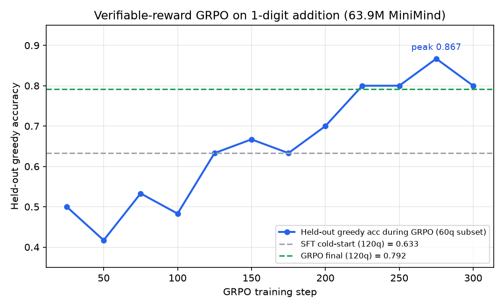

# 可验证奖励 GRPO（RLVR）：让强化学习真正改变"答案对错"

> 上一组 GRPO 实验用的是**纯规则奖励**（长度 / 思维标签 / 重复惩罚），它只能约束输出的**表面格式**，无法判断内容是否正确（100 条 held-out 上规则分 +0.084，但答案对错不变）。
> 本实验补上**可验证奖励（Reinforcement Learning with Verifiable Rewards, RLVR）**：数学题答案唯一、可程序化判分，答对 +1、答错 0，让 GRPO 直接朝"答得对"优化。
> 所有数字均来自 RTX 3080 Ti 单卡真实训练与独立评测，原始日志 / 数据 / 评测结果见本目录。

## 1. 为什么需要"SFT 冷启动甜区"（最关键的前提）

**强化学习不向模型注入新知识，只重新分配已有能力的概率。** 对一道模型当前完全不会的题，它对同一题采样 G=4 次会**全部答错**，组内奖励全为 0 → 组内优势恒为 0 → 这一步对该题没有任何梯度。因此 RLVR 的前提是：**SFT 先把模型带到"采样时偶尔能答对"的半会状态（甜区）**，RL 才能把这些"偶尔对"的概率不断放大。

为定位甜区，我在一位加法（1–9）上用同一基座、只改 SFT 训练量做探测（from `full_sft`，lr 1e-5）：

| SFT 冷启动训练量 | greedy 正确率 | 采样 T=0.8 正确率 | 是否适合接 GRPO |
|---|---|---|---|
| 1 epoch（250 步，loss→0.39） | **0.633** | **0.483** | 甜区：每组 4 条采样通常有对有错，优势信号充足 |
| 2 epoch（500 步） | 0.967 | 0.950 | 已近天花板，RL 无空间 |

> 对照：在**两位加法（10–99、含进位）**上，冷启动 6 epoch 才到 greedy 0.50，但错题是"没学会进位算法"，采样也几乎采不对，RL 同样学不动（见 §5 边界实验）。**任务必须落在模型能力边界内、只是"不够稳"，RLVR 才有效。**

## 2. 任务、数据与奖励

- **任务**：一位加法 `a + b`（a,b ∈ 1–9，和 ≤ 18），要求直接输出最终数字、不写过程。
- **数据**：`gen_arith_data.py` 生成 4000 条训练 / 120 条 held-out 评测（答案为纯数字字符串）。
- **可验证奖励**：从生成文本里抽取最后一个整数，与 gold 比对，正确=1.0 / 错误=0.0，无需任何奖励模型。
- **冷启动**：`full_sft` → 任务专属 SFT 1 epoch，得到 `arith_sft`（greedy 0.633）。

## 3. GRPO 实现与超参

`train_grpo_arith.py` 复用官方 `TorchRolloutEngine` 保证在线采样与 old-logprob 正确，训练循环忠实复刻官方 CISPO 形式：

- 每步对 **B=8** 个 prompt 各采样 **G=4** 条（T=0.8、max_new_tokens=16）；
- 组内相对优势 A = (r − mean_group) / (std_group + ε)（组内全对 / 全错时 std=0、优势自然为 0）；
- 重要性比 ratio + CISPO 上界裁剪、**β·KL 锚定冻结参考模型**、token mask 归一、AdamW + cosine lr；
- 超参：**300 步，lr 4e-6，β(KL)=0.08，bf16**；每 25 步在固定 held-out 上做 greedy 评测。

## 4. 主结果（独立 120 题，可复现）



训练中 held-out（60 题子集）greedy 正确率从 ~0.50 稳步升到 0.80（step275 峰值 0.867），KL 始终被 β=0.08 锚定（|KL| 多在 0.1 量级，未漂移）。**最终用与训练完全独立的 120 题评测确认：**

| 评测口径 | SFT 冷启动 | 可验证 GRPO | 提升 |
|---|---|---|---|
| greedy（确定性解码，120 题） | 0.633（76/120） | **0.792（95/120）** | **+0.159（相对 +25%）** |
| 采样 T=0.8，3 个随机种子均值 | 0.503（181/360） | **0.603（217/360）** | **+0.100（相对 +20%）** |

三个采样种子（seedbase 3000/4000/5000）逐次对比，GRPO 每次都不低于 SFT（SFT 0.483/0.542/0.483；GRPO 0.617/0.617/0.575），方向稳定，不是单次噪声。训练曲线末值（0.80）与独立 120 题（0.792）一致。

## 5. 边界与负结果（同样真实，且更能说明 RL 的本质）

为弄清"什么情况下 RLVR 有效"，我额外做了三组对照，全部失败或无效，这些和主结果同样重要：

1. **任务超出能力边界 → RL 教不会新知识。** 两位加法（含进位）冷启动到 greedy 0.50 后，用弱 RL（lr 2e-6、β 0.04、300 步）训练，独立 120 题 greedy 0.675→0.675 持平、采样仅 +0.017。原因：不会进位的题 4 次采样全错、优势恒 0，没有梯度；RL 只能巩固"本来就半会"的题。
2. **lr 过大 + KL 锚定太弱 → 策略崩溃（policy collapse）。** 同一两位加法甜区用 lr 8e-6、β 0.02、400 步，held-out greedy 不升反**崩到 0.03–0.27**，KL 偏离到 −2.9，大量 batch 组内全错（adv_std=0）陷入"越错越没梯度"的恶性循环。这正说明 RLHF 中 **KL 正则锚定参考模型、学习率必须保守**的原因。
3. **SFT 已到天花板 → RL 没有空间。** 一位加法冷启动 2 epoch 已 greedy 0.967，此时弱 RL 持平、强 RL 只会在 greedy / 采样间震荡甚至略降。

> 方法论补充：训练中 60 题子集的曲线噪声约 ±0.1，**一切结论以独立 120 题、多随机种子的评测为准**——早期几轮曾出现"训练曲线涨、独立评测不涨"的假象，正是小样本评测 + fp16 存盘量化造成的，改用 fp32 评测、扩大评测集后才得到 §4 的可信结论。

## 6. 三类奖励来源对比

| 奖励类型 | 怎么打分 | 优点 | 局限 | 本库对应实验 |
|---|---|---|---|---|
| 纯规则奖励 | 长度 / 标签 / 重复度等启发式 | 零成本、绝对稳定 | 只约束表面格式，不判对错 | `experiments/grpo/`（规则分 +0.084，不改正确性） |
| **可验证奖励（RLVR）** | 答案对/错由程序判定（数学、代码单测） | 精确、无额外模型、难被 hack | 仅适用于有标准答案 / 可自动验证的任务 | **本目录（greedy +25%）** |
| 学习型奖励模型 | 训练一个 reward model 对任意回答打分 | 通用、可评价开放问题 | 需额外大模型、可能被 reward hacking | 官方 internlm2-1.8b-reward，本库有意移除 |

## 7. 文件与复现

```text
reproduced/
  gen_arith_data.py      # 生成加法 SFT/评测数据
  train_grpo_arith.py    # 可验证奖励 GRPO 主脚本（复用 TorchRolloutEngine + CISPO + βKL）
  eval_arith.py          # 独立评测（--temp 0=greedy / 0.8=采样，--seedbase 换种子）
  probe_arith.py         # 对 full_sft 基座的算术基线探测
experiments/verifiable_rl/
  arith_grpo.log         # 完整训练日志（含每 25 步 held-out 正确率）
  arith_grpo_train.log   # 脚本落盘的精简指标
  arith_sft.log          # 冷启动 SFT 日志
  arith_sft.jsonl        # 4000 条训练数据
  arith_eval.jsonl       # 120 条 held-out
  s_*/fin_*/ss_*.txt     # 各口径 / 各种子的原始评测结果
experiments/assets/verifiable_rl_curve.png
```

```bash
# 1) 造数；2) SFT 冷启动到甜区（须在 trainer/ 下运行官方脚本）
python gen_arith_data.py
cd trainer && python train_full_sft.py --data_path ../dataset/arith_sft.jsonl \
  --from_weight full_sft --save_weight arith_sft --epochs 1 \
  --batch_size 16 --learning_rate 1e-5 --max_seq_len 128
# 3) 可验证奖励 GRPO；4) 独立前后对比
cd .. && python train_grpo_arith.py
python eval_arith.py --weight arith_sft  --temp 0     # 0.633
python eval_arith.py --weight arith_grpo --temp 0     # 0.792
```

## 8. 一句话结论

> 在模型**能力边界内、SFT 已带到"采样能偶尔答对"的甜区**时，可验证奖励 GRPO 能把一位加法 held-out 正确率 greedy 0.633→0.792、采样 0.503→0.603；但 RL **只放大已有能力、不注入新知识**——任务太难（组内全错）、SFT 太满（到天花板）、或 lr 过大 KL 太弱（策略崩溃）时都不会有效。