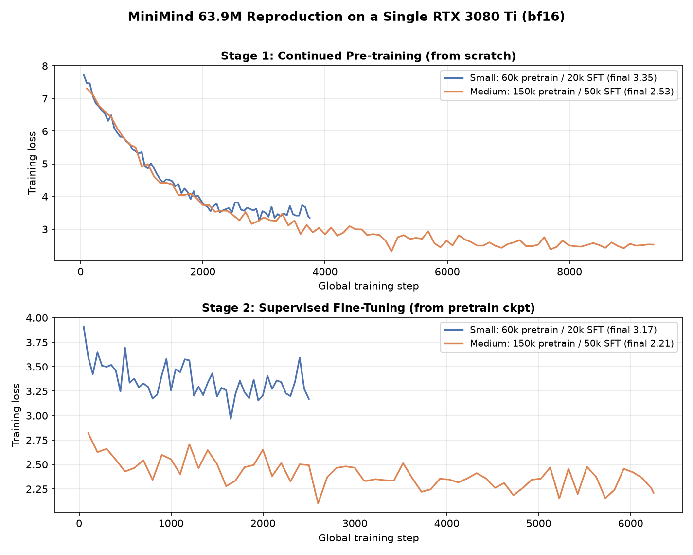

# 实验记录（Experiments）

> 单卡 **RTX 3080 Ti 12GB** 上，从零复现 MiniMind（63.9M）的 **继续预训练 → 监督微调（SFT）** 全流程。
> 所有数字均来自真实训练日志（`*/` 目录下的 `*_curve.csv`、`metrics.txt`），曲线图见 `assets/`。

## 1. 运行环境

| 项 | 配置 |
| --- | --- |
| GPU | 1 × NVIDIA RTX 3080 Ti（12 GB GDDR6X），驱动 580.76.05 |
| 框架 | Python 3.10、PyTorch 2.6.0+cu124、Transformers 4.57.6、datasets 3.6.0 |
| 精度 | BF16 混合精度（`torch.cuda.amp.autocast`） |
| 模型 | MiniMind，hidden=768、8 层、8 头、**GQA（KV 头=4）**、词表 6400，**参数量 63.91M** |
| 数据 | ModelScope `gongjy/minimind_dataset`：pretrain 全量 127.0 万条、SFT 全量 90.6 万条多轮对话 |

> 复现踩坑：该机器上 `pip` 直接拉取数百 MB 的大 wheel（torch / nvidia-cudnn 等）会零增长卡死，
> 最终改用 **curl 逐包下载 + `pip install --no-index --find-links` 离线安装**解决，详见 `../reproduced/`。

## 2. 数据准备：等间隔抽样

全量数据在单卡上训练 2 轮需要十余小时。为在可控时间内完成端到端复现并对比**数据规模效应**，
采用**等间隔抽样**（每隔 k 行取 1 条，覆盖整个文件、避免头部数据分布偏斜）构造两档子集：

| 子集 | pretrain 条数 | SFT 条数 | 占全量比例（pretrain/SFT） |
| --- | --- | --- | --- |
| small | 60,000 | 20,000 | 4.7% / 2.2% |
| medium | 150,000 | 50,000 | 11.8% / 5.5% |

抽样脚本见 `../reproduced/make_subsets.py`。

## 3. 超参数

| 阶段 | batch | 梯度累积 | 有效 batch | 学习率 | 调度 | 最大长度 | epochs |
| --- | --- | --- | --- | --- | --- | --- | --- |
| Pretrain | 32 | 8 | 256 | 5e-4 | cosine + warmup | 340 | 2 |
| SFT | 16 | 1 | 16 | 1e-5 | cosine | 768 | 2 |

优化器 AdamW、梯度裁剪 1.0；SFT 从上一阶段 pretrain 权重热启动，且**仅对 assistant 回复部分计算损失**。

## 4. 实验结果

| 实验 | 阶段 | 训练步数 | 耗时 | 起始→最终 loss | 显存峰值 | 平均 GPU 利用率 |
| --- | --- | --- | --- | --- | --- | --- |
| **small** | Pretrain | 3,750 | 10.3 min | 7.73 → **3.35** | 7.36 GB | 97.1% |
| **small** | SFT | 2,500 | 8.0 min | 3.91 → **3.17** | 7.36 GB | 97.1% |
| **medium** | Pretrain | 9,376 | 25.5 min | 7.31 → **2.53** | 7.36 GB | 98.8% |
| **medium** | SFT | 6,250 | 19.6 min | 2.82 → **2.21** | 7.36 GB | 98.8% |

推理（FP16，单条 `model.generate`）解码速度约 **47–100 tokens/s**。

## 5. 关键发现

1. **数据规模的边际收益清晰可见**：pretrain 数据量 ×2.5（6 万→15 万），同架构同超参下最终 loss 由 3.35 降到 2.53；
   SFT 由 3.17 降到 2.21，且 medium 模型生成的语句连贯度、指令遵循度明显更好（见 `generation_samples.md`）。
2. **Pretrain 与 SFT 分工明确（消融）**：只做 pretrain 的模型只会**续写**、无法遵循指令
   （让写斐波那契函数时输出一串数字）；经过 SFT 后才学会 chat template、以助手身份分点作答。
3. **小模型单卡可训**：63.9M 模型在 12GB 卡上 bf16 训练，显存峰值仅 7.36 GB、GPU 利用率长期 97–99%，
   说明该规模不存在显存/通信瓶颈，瓶颈在**数据量与训练 token 数**。
4. **loss 与生成质量并不完全等价**：SFT loss 降到 2.2 后，模型已能稳定输出结构化中文，但受限于 63M 参数量与
   仅 ~5% 的训练数据，仍存在事实性错误、重复、代码语法错误——这与 Chinchilla「小模型需要足够 token」的结论一致，
   也是后续用全量数据 / 扩参的改进方向。

## 6. 目录与复现

- `small/`、`medium/`：各自的 `pretrain_curve.csv`、`sft_curve.csv`（逐步 loss/lr）、`metrics.txt`、原始生成记录；
- `assets/`：loss 对比曲线与 GPU 画像；
- `generation_samples.md`：三模型（pretrain-only / small-SFT / medium-SFT）生成样例对比；
- 完整复现命令见 [`../reproduced/`](../reproduced/)。

> 说明：模型权重（.pth，单个约 132MB）按 `.gitignore` 约定不上传；数据来自 ModelScope 公开数据集，按其许可使用。
